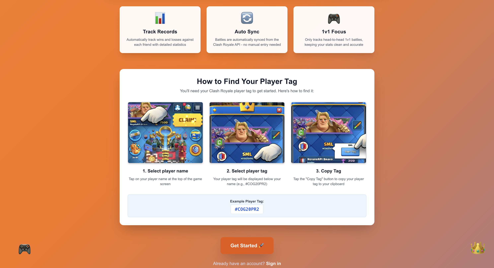
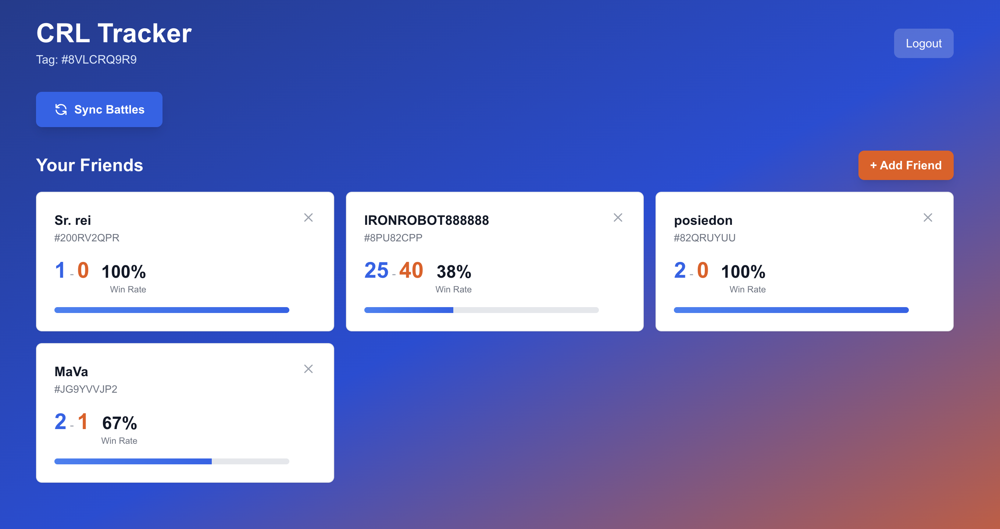

# CRL Tracker

A full-stack web application that allows Clash Royale players to track their head-to-head battle statistics against friends. Built with modern web technologies and designed with data minimization principles at its core.

## Overview

CRL Tracker integrates with the official Clash Royale API to automatically sync and track 1v1 battle records between players and their friends. The application demonstrates proficiency in full-stack development, API integration, database design, and privacy-conscious architecture.

## How to Use the Website

### Getting Started

When you first visit the application, you'll see an onboarding page that guides you through finding your Clash Royale player tag:



The landing page highlights three key features:
- **Track Records**: Automatically track wins and losses against each friend with detailed statistics
- **Auto Sync**: Battles are automatically synced from the Clash Royale API - no manual entry needed
- **1v1 Focus**: Only tracks head-to-head 1v1 battles, keeping your stats clean and accurate

The page includes a step-by-step visual guide showing how to find your player tag in the Clash Royale app. Once you have your tag, sign up for an account and you're ready to start tracking!

### Key Features

#### 1. Track Records
Automatically track wins and losses against each friend with detailed statistics. The dashboard displays:
- Individual win/loss records for each friend
- Win percentage calculations
- Visual progress bars for quick stat overview

#### 2. Auto Sync
Battles are automatically synced from the Clash Royale API - no manual entry needed. The application runs a daily cron job to keep all statistics up-to-date, and users can manually trigger a sync at any time using the "Sync Battles" button.

#### 3. 1v1 Focus
Only tracks head-to-head 1v1 battles, keeping your stats clean and accurate. The application intelligently filters out 2v2 battles, challenges, and other game modes to maintain precise statistics.

### Using the Dashboard



Once logged in, the dashboard provides:

- **Your Player Tag**: Displayed at the top for easy reference
- **Sync Battles Button**: Manually trigger a battle sync to get the latest statistics
- **Friend Management**: 
  - Add friends using the "+ Add Friend" button
  - View each friend's battle statistics in individual cards
  - Remove friends using the X icon on each card
- **Statistics Display**: Each friend card shows:
  - Friend's name and player tag
  - Total wins (in blue) and losses (in orange)
  - Win percentage
  - Visual progress bar representing win rate

## Technical Stack

### Frontend
- **Next.js 16** with App Router - Modern React framework with server-side rendering and API routes
- **React 19** - Latest React features for component-based UI development
- **TypeScript** - Type-safe development for improved code quality and maintainability
- **Tailwind CSS** - Utility-first CSS framework for rapid, responsive UI development
- **React Hot Toast** - User-friendly notification system

### Backend & Infrastructure
- **Next.js API Routes** - Serverless API endpoints for battle syncing and friend management
- **Supabase** - PostgreSQL database with built-in authentication and Row Level Security (RLS)
- **Vercel Cron Jobs** - Automated daily battle synchronization (runs at 2 AM UTC)
- **Clash Royale Official API** - Integration with Supercell's public API for battle data

### Development & Testing
- **Jest** - Comprehensive unit and integration testing
- **React Testing Library** - Component testing with user-centric approach
- **TypeScript** - Full type coverage across the application

## Data Minimization Strategy

This application is designed with privacy and data efficiency as core principles. Here's how we minimize data storage:

### What We Store
1. **User Authentication**: Only essential account information (managed by Supabase Auth)
2. **Player Tags**: Public identifiers only (e.g., #8VLCRQ9R9) - no passwords or game credentials
3. **Friend Relationships**: Friend player tags and names (publicly available information)
4. **Aggregated Statistics**: Only win/loss counts per friend relationship
5. **Minimal Battle History**: Only the last 25 battles per user are retained for processing purposes

### What We Don't Store
- ❌ Full battle logs or detailed match data
- ❌ Deck compositions or card information
- ❌ Personal information beyond what's necessary for authentication
- ❌ Game account credentials or tokens
- ❌ Historical battle data beyond recent processing needs

### How It Works
The application uses a **pull-based architecture**:
- Player tags are the only required input from users (publicly available)
- Battle data is fetched on-demand from the Clash Royale API
- Statistics are calculated and aggregated in real-time
- Old battle records are automatically cleaned up, keeping only the most recent 25 per user
- No sensitive game data is stored locally

This approach ensures the application maintains the **absolute minimum data footprint** while providing full functionality.

## Architecture Highlights

### API Integration
- Robust error handling for external API calls
- Rate limiting awareness and graceful degradation
- Efficient battle filtering (1v1 only) at the processing layer
- Duplicate battle prevention using battle ID tracking

### Database Design
- **Row Level Security (RLS)**: All tables protected with user-scoped access policies
- **Optimized Indexes**: Strategic indexing for fast queries on user_id and player tags
- **Referential Integrity**: Foreign key constraints ensure data consistency
- **Automatic Cleanup**: Database triggers and cleanup functions maintain lean storage

### Background Processing
- **Cron Job**: Automated daily sync for all users (configurable via Vercel)
- **Manual Sync**: On-demand battle synchronization via API endpoint
- **Batch Processing**: Efficient handling of multiple users and battles

### Security
- **Server-Side Authentication**: Secure session management with Supabase
- **API Route Protection**: Middleware ensures authenticated access
- **Service Role Isolation**: Sensitive operations use service role keys, never exposed to client

## Testing

The application includes comprehensive test coverage:

```bash
npm test
```

Tests verify:
- Proper filtering of 1v1 battles vs other battle types
- Correct skipping of battles against untracked friends
- Graceful handling of API errors and edge cases
- User data isolation and security
- Battle processing logic accuracy


## Key Programming Skills Demonstrated

- **Full-Stack Development**: End-to-end application from UI to database
- **API Integration**: Third-party API consumption with error handling and rate limiting
- **Database Design**: Efficient schema design with RLS, indexes, and cleanup strategies
- **TypeScript**: Type-safe development across the entire codebase
- **Modern React**: Latest React patterns with Server Components and App Router
- **Testing**: Comprehensive test suite with Jest and React Testing Library
- **DevOps**: CI/CD with Vercel, automated cron jobs, and environment management
- **Security**: Authentication, authorization, and data privacy best practices
- **Performance**: Optimized queries, efficient data processing, and minimal storage footprint

## License

ISC
